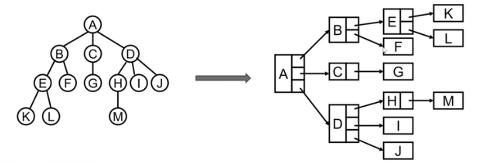
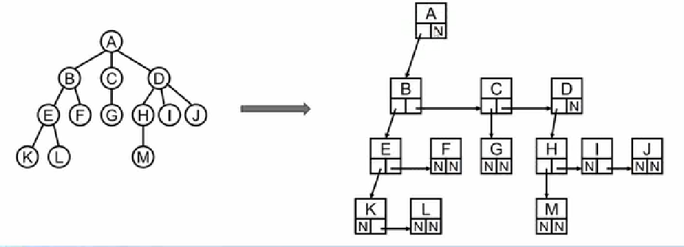
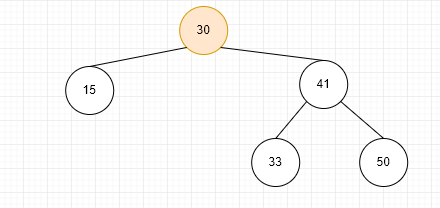

# 树


>  下面哪一个是树


## 树的术语

- 1节点的度（ `Degree`）:节点的子树个数

- 2树的度:树的所有节点中最大的度数

- 3叶节点（`Leaf`）:度为0的节点.（也称为叶子节点）

- 4父节点（` Parent`）:有子树的节点是其子树的根节点的父节点

- 5子节点（ `Child`）:若A节点是B节点的父节点，则称B节点是A节点的子节点;子节点也称孩子节点。

- 6兄弟节点（ `Sibling`）:具有同一父节点的各节点彼此是兄弟节点

- 7路径和路径长度:从节点`n1`到`nk`的路径为一个节点序列`n1，n2…，nk，ni`是`n+1`的父节点。路径所包含边

的个数为路径的长度

- 8节点的层次（` Level`）:规定根节点在1层，其它任节点的层数是其父节点的层数加1

- 9树的深度（ `Depth`）:树中所有节点中的最大层次是这棵树的深度。


## 非二叉树转换成二叉树






## 如何封装二叉树


>  二叉搜索树有哪些常见的操作呢？

- `insert(key)`:向树中插入一个新的键。

- `search(key)`:在树中查找一个键，如果节点存在，则返回true;如果不存在，则返回 false

- `inOrderTraverse()`:通过中序遍历方式遍历所有节点。

- `preOrderTraverse()`:通过先序遍历方式遍历所有节点。

- `postOrderTraverse()`:通过后序遍历方式遍历所有节点。

- `min()`:返回树中最小的值/键。

- `max()`:返回树中最大的值/键。

- `remove(key)`:从树中移除某个键。


## 二叉树最主要的应用----二叉搜索树

二叉搜索树（`BST`， `Binary Search Tree`），也称二叉排序树或二叉查找树

- 二叉搜索树是一颗二叉树，可以为空

- 如果不为空，满足以下性质
  - 非空左子树的所有键值小于其根节点的键值。	
  - 非空右子树的所有键值大于或等于其根节点的键值。

- 左、右子树本身也都是二又搜索树。

**下面哪些是二叉搜索树，哪些不是**





> `insert`:插入方法

```js
insert(key) {
    //1: node创建出来
    let node = new Node(key);

    if (!this.root) {
      this.root = node;
    } else {
      this._insertNode(this.root, node);
    }
  }

  _insertNode(node, newNode) {
    if (node.key > newNode.key) {
      //往左插入
      if (!node.left) {
        node.left = newNode;
      } else {
        this._insertNode(node.left, newNode)
      }
    } else {
      if (!node.right) {
        node.right = newNode;
      } else {
        this._insertNode(node.right, newNode);
      }
    }
  }
```

> `search` :查找方法

```js
search(key) {
    return this._searchNode(this.root, key);
  }

_searchNode(node, key) {
    if (!node) return false;
    if (node.key < key) return this._searchNode(node.right, key);
    else if (node.key > key) return this._searchNode(node.left, key);
    else return node.key === key;
  }
```

> `preOrderTraverse` :先序遍历方法

```js

```

> `inOrderTraverse` : 中序方法


```js
//中序遍历
  midOrderTraverse(handler) {
    this._midOrderTraverse(this.root, handler);
  }

  _midOrderTraverse(node, handler) {
    if (node) {
      this._midOrderTraverse(node.left, handler);
      handler(node.key);
      this._midOrderTraverse(node.right, handler);
    }
  }
```

> `postOrderTraverse`后序遍历方法

```js

```

> `max`: 树中最大值

```js
max() {
    let node = this.root;
    while (node.right) node = node.right;
    return node.key;
  }
```

> `min`:树中最小值方法

```js
 min() {
    let node = this.root;
    while (node.left) {
      node = node.left;
    }
    return node.key;
  }
```

> `remove` :删除方法

```js

```

