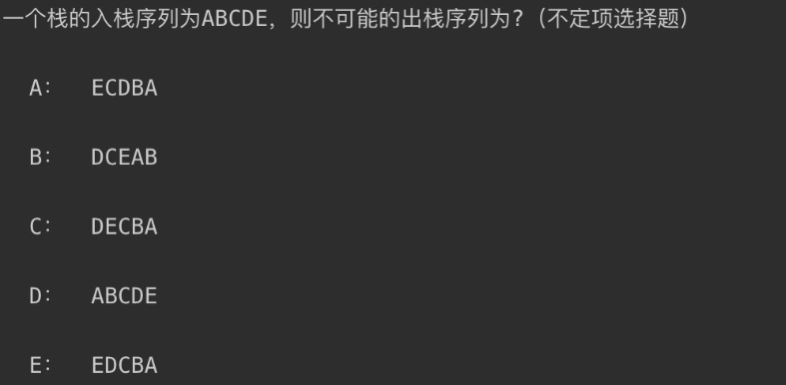
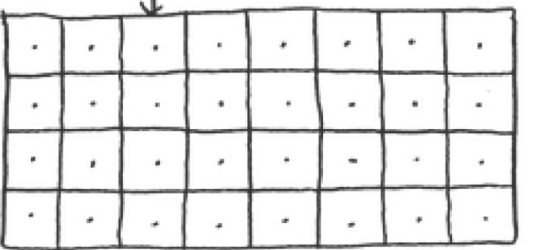
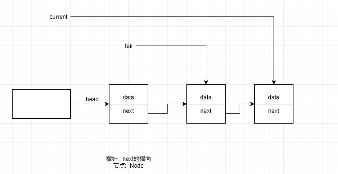

# 链表

> 回顾 栈的考研题




## 数据结构

- 1. 栈: 先进后出 后进先出

- 2. 队列 : 先进先出

- 3. 链表

- 4. 数组 列表

### 计算机内存地址





 

### 列表(数组)  操作 

- 缺点 : 插入或者删除  很浪费性能

- 有点: 查找 修改


###  链表 指针 data+next  

- 优点: 插入 删除 

- 缺点  查找  


### 关于链表的示意图




### 链表常见操作方法

> 封装链表

```js
class LinkedList {
  constructor() {
    this.head = null;
    this.length = 0;
    this.tail = null;
  }
}

class Node {
  constructor(data, next = null) {
    this.data = data;
    this.next = next;
  }
}

```


> append`方法

```js
append(data) {
    let node = new Node(data);
    //node  data:传过来的值
    //next :null

    //this.head = node;
    //第一种情况 第一次添加 改变的是head
    if (!this.head) {
      this.head = node;
      //指向的是最后一个元素
      this.tail = node;
    } else {
      //改变tail的next指向
      this.tail.next = node;
      //改变tail 的值
      this.tail = node;
    }

    this.length += 1;
    return this;
  }

```

> 转换数组 `toArray`

```js
 /*变成数组*/
  toArray() {
    let current = this.head;
    let arr = [];
    while (current) {
      arr.push(current.data);
      current = current.next;
    }
    return arr;
  }
```

> 获取元素 `get(position)`

```js
get(position) {
    let index = 0;
    let current = this.head;
    while (index++ < position) {
      current = current.next;
    }
    return current.data;
  }
```

> 删除元素 `removeAt(position)`

```js
removeAt(position) {
    if (position < 0 || position > this.length - 1 || this.length <= 0) return false;
    let current = this.head;
    if (position === 0) {
      this.head = this.head.next;
    } else {
      let index = 0;
      let previous = null;
      while (index++ < position) {
        previous = current;
        current = current.next;
      }
      previous.next = current.next;
      //删除最后一个元素
      if (this.length - 1 === position) this.tail = previous;
      //删除之后数组长度-1
    }
    this.length -= 1;
    return current.data;
  }
```

> 插入元素` insert(position,element)`

```js

  insert(position, data) {
    if (position < 0 || position > this.length) return false;
    let node = new Node(data);
    //插入的是不是第一个数据
    if (position === 0) {
      //1: 第一个数据是空的
      if (!this.head) {
        this.head = node;
        //一定要指向最后一个
        this.tail = node;
      } else {
        //新元素的node.next 指向this.head
        node.next = this.head;
        this.head = node;
      }
    } else {
      //1:循环
      //2:改变
      let index = 0;
      let current = this.head;
      let previous = null;
      while (index++ < position) {
        previous = current;
        current = current.next
      }
      //插入的时候 上一个节点 指向改变
      previous.next = node;
      //current
      node.next = current;
      if (position === this.length) {
        this.tail = node;
      }
    }
    return this;
  }

```

>  获取元素下标 `indexOf(data)`

```js
 indexOf(data) {
    let index = 0;
    let current = this.head;
    while (current) {
      if (current.data === data) return index;
      current = current.next;
      index += 1;
    }
    return -1;
  }
```

> 更新方法`update(position,newData)`

```js
update(position, newData) {
    if (position < 0 || position > this.length - 1) return false;
    let current = this.head;
    let index = 0;
    while (current) {
      if (index === position) {
        current.data = newData;
        return true;
      }
      index++;
      current = current.next;
    }
  }
```

