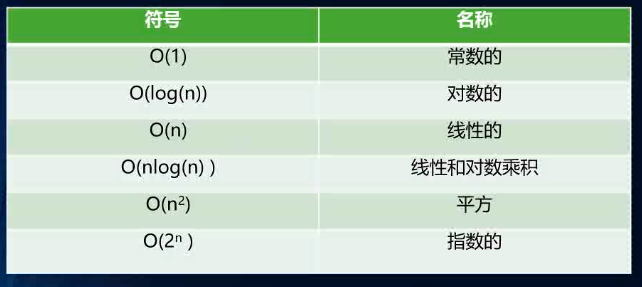
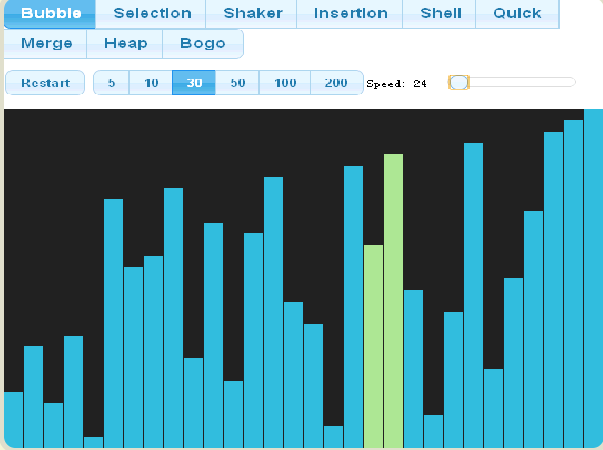
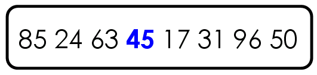
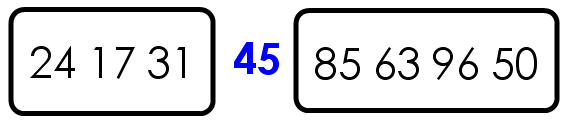
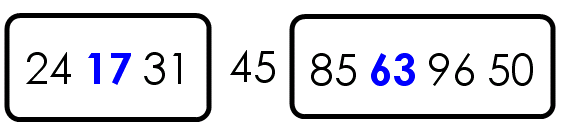
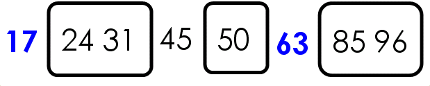

# 算法


## 1. 大O表示法

在算法的描述中，我们也可以通过类似的快捷方式来描述计算机算法的效率.

在计算机中，这种粗略的度量被称作”大O”表示法

在算法比较的过程中我们可能更喜欢说算法A比算法快两倍但是这样的比较有时候没有意义

在数据项个数发生变化时，算法的效率会跟着发生改变.

所以我们通常使用一种算法的速度会如何跟随着**数据量**的变化的




### 1.1 推导算法的方式

①用常量1取代运行时间中所有的加法常量  O(1)    O(N)

②在修改后的运行次数函数中只保留最高阶项 

③如果最高存在且不为1，则去除与这个项相乘的常数   几层循环 1 O(N²)  O(N) O(1) 

N*(N-1)+2  冒泡

2² O(1)


## 2  排序算法

- 一般是笔试最后一题
- 排序算法有很多:
  - 冒泡排序
  - 选择排序
  - 插入排序
  - 归并排序
  - 计数排序（counting sort）
  - 基数排序（radix sort）
  - 希尔排序
  - 堆排序
  - 桶排序
- 我们这里不——列举它们的实现思想，而是选择几个简单排序和高级排序.
- 简单排序：**冒泡排序-选择排序-插入排序**.
- 高级排序：**希尔排序-快速排序**.

### 2.1 为什么学习排序


- 比如对姓名按字母排序

- 对学生按年龄排序

- 对商品按照价格排序

- 对城市按照面积或者人口数量排序 


### 2.2 排序算法的实现

为了方便 我们先写一个列表类 封装各个方法

```js

```

## 3 冒泡排序


### 代码实现

```js


```

### 3.1 冒泡排序的效率

#### 3.1.1 冒泡排序的比较次数(时间复杂度)

对于7个数据项比较次数:6+5+4+3+2+1

（N-1）+（N-2）+(N-3）+…+1=N*（N-1）/2

通过算法推到过程: 

N²/2，根据规则3，变成N²

时间复杂度 算法为O(N²)  

#### 3.1.2 冒泡排序的交换次数 (空间复杂度)

真实的次数:N*(N-1)/2

空间复杂度大O表示也是O(N²)


## 4 选择排序


### 代码实现

```js

```

## 5 快速排序（Quicksort）的Javascript实现




[排序算法](http://en.wikipedia.org/wiki/Sorting_algorithm)（Sorting algorithm）是计算机科学最古老、最基本的课题之一。要想成为合格的程序员，就必须理解和掌握各种排序算法。

目前，最常见的排序算法大概有七八种，其中["快速排序"](http://en.wikipedia.org/wiki/Quicksort)（Quicksort）使用得最广泛，速度也较快。它是图灵奖得主C. A. R. Hoare（1934--）于1960时提出来的。


"快速排序"的思想很简单，整个排序过程只需要三步：

> 　　（1）在数据集之中，选择一个元素作为"基准"（pivot）。
>
> 　　（2）所有小于"基准"的元素，都移到"基准"的左边；所有大于"基准"的元素，都移到"基准"的右边。
>
> 　　（3）对"基准"左边和右边的两个子集，不断重复第一步和第二步，直到所有子集只剩下一个元素为止。

举例来说，现在有一个数据集{85, 24, 63, 45, 17, 31, 96, 50}，怎么对其排序呢？

第一步，选择中间的元素45作为"基准"。（基准值可以任意选择，但是选择中间的值比较容易理解。）



第二步，按照顺序，将每个元素与"基准"进行比较，形成两个子集，一个"小于45"，另一个"大于等于45"。



第三步，对两个子集不断重复第一步和第二步，直到所有子集只剩下一个元素为止。






首先，定义一个`quickSort`函数，它的参数是一个数组。

```js
var quickSort = function(arr) {

};
```


然后，检查数组的元素个数，如果小于等于1，就返回。

```js
var quickSort = function(arr) {
　　if (arr.length <= 1) { return arr; }

};
```


接着，选择"基准"（pivot），并将其与原数组分离，再定义两个空数组，用来存放一左一右的两个子集。

```js
var quickSort = function(arr) {
　　if (arr.length <= 1) { return arr; }
　　var pivotIndex = Math.floor(arr.length / 2) ;
　　var pivot = arr.splice(pivotIndex, 1)[0];
　　var left = [];
　　var right = [];
};
```


然后，开始遍历数组，小于"基准"的元素放入左边的子集，大于基准的元素放入右边的子集。

```js
var quickSort = function(arr) {
　　if (arr.length <= 1) { return arr; }
　　var pivotIndex = Math.floor(arr.length / 2) ;
　　var pivot = arr.splice(pivotIndex, 1)[0];
　　var left = [];
　　var right = [];
　　for (var i = 0; i < arr.length; i++){
　　　　if (arr[i] < pivot) {
　　　　　　left.push(arr[i]);
　　　　} else {
　　　　　　right.push(arr[i]);
　　　　}
　　}

};
```


最后，使用递归不断重复这个过程，就可以得到排序后的数组。

```js
var quickSort = function(arr) {
　　if (arr.length <= 1) { return arr; }
　　var pivotIndex = Math.floor(arr.length / 2);
　　var pivot = arr.splice(pivotIndex, 1)[0];
　　var left = [];
　　var right = [];
　　for (var i = 0; i < arr.length; i++){
　　　　if (arr[i] < pivot) {
　　　　　　left.push(arr[i]);
　　　　} else {
　　　　　　right.push(arr[i]);
　　　　}
　　}
　　return quickSort(left).concat([pivot], quickSort(right));

};
```


使用的时候，直接调用quickSort()就行了。

